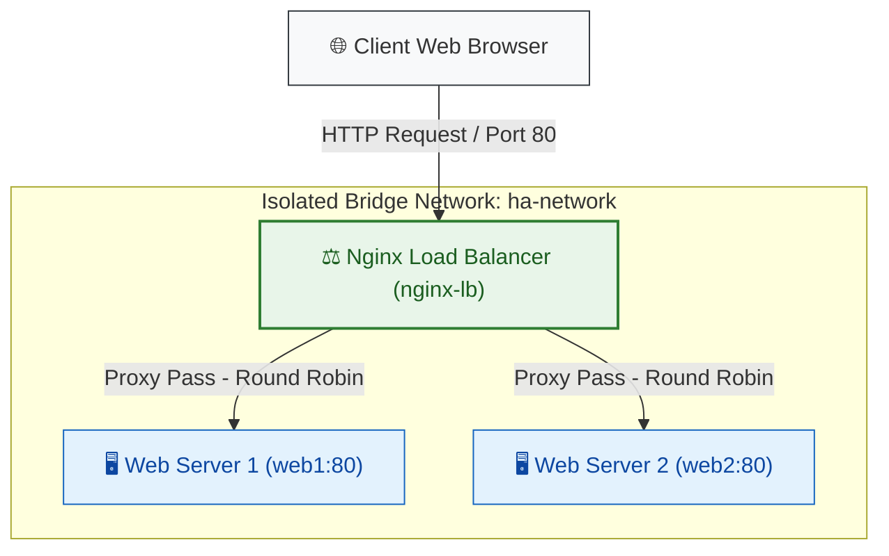

# ⚖️ High-Availability Web Architecture with Docker & NGINX Load Balancing

[](https://www.docker.com/)
[](https://nginx.org/)
[](#)

A production-grade demonstration of **High Availability (HA)**, **Load Balancing**, and **Dynamic Scaling** using NGINX and Docker. This project serves as a step-by-step lab manual and a reference implementation for deploying load-balanced web services in an isolated virtual network.

---

## 🗺️ System Architecture

The following diagram illustrates how incoming client requests are routed through the NGINX Load Balancer to the active backend servers over an isolated Docker bridge network.



---

## 🚀 Key Features

* **High Availability**: Automatically redirects traffic if one or more backend containers go offline.
* **Load Distribution**: Demonstrates Round-Robin distribution with optional support for alternative routing algorithms (Least Connections, IP Hash).
* **Isolation**: All containers communicate inside a private, dedicated Docker network (`ha-network`).
* **Easy Scalability**: Spin up additional backend instances dynamically using a single command.

---

## 🛠️ Step 1 — Prerequisites & Environment Setup

Ensure your local machine or VM has **Docker** and **Docker Compose** installed:

```bash
# Check Docker installation
docker --version

# Check Docker Compose installation
docker-compose --version
```

---

## 📁 Step 2 — Create Project Structure

Set up the project workspace in a dedicated directory:

```bash
mkdir ha-demo
cd ha-demo
mkdir web1 web2 nginx
```

Your final directory structure will look like this:

```text
ha-demo/
 ├── web1/
 │    └── index.html
 ├── web2/
 │    └── index.html
 ├── nginx/
 │    └── nginx.conf
 └── docker-compose.yml
```

---

## 💻 Step 3 — Create Backend Servers

To make the load balancing immediately obvious, we will create visually distinct pages for each server with a premium, responsive layout.

### 🔹 Web Server 1 (`web1/index.html`)

Create and edit `web1/index.html`:

```html
<!DOCTYPE html>
<html lang="en">
<head>
    <meta charset="UTF-8">
    <meta name="viewport" content="width=device-width, initial-scale=1.0">
    <title>Web Server 1</title>
    <style>
        body {
            font-family: 'Outfit', sans-serif;
            background: linear-gradient(135deg, #0f2027, #203a43, #2c5364);
            color: #ffffff;
            display: flex;
            justify-content: center;
            align-items: center;
            height: 100vh;
            margin: 0;
        }
        .card {
            background: rgba(255, 255, 255, 0.1);
            backdrop-filter: blur(10px);
            border-radius: 16px;
            padding: 40px;
            box-shadow: 0 8px 32px 0 rgba(0, 0, 0, 0.37);
            border: 1px solid rgba(255, 255, 255, 0.18);
            text-align: center;
            max-width: 400px;
        }
        h1 {
            margin-top: 0;
            color: #4fc3f7;
        }
        .status {
            display: inline-block;
            background: #2e7d32;
            color: #e8f5e9;
            padding: 6px 12px;
            border-radius: 20px;
            font-size: 0.85em;
            font-weight: bold;
            text-transform: uppercase;
        }
    </style>
</head>
<body>
    <div class="card">
        <h1>🖥️ Web Server 1</h1>
        <p>This request was processed by the primary server container.</p>
        <span class="status">Active & Healthy</span>
    </div>
</body>
</html>
```

### 🔸 Web Server 2 (`web2/index.html`)

Create and edit `web2/index.html`:

```html
<!DOCTYPE html>
<html lang="en">
<head>
    <meta charset="UTF-8">
    <meta name="viewport" content="width=device-width, initial-scale=1.0">
    <title>Web Server 2</title>
    <style>
        body {
            font-family: 'Outfit', sans-serif;
            background: linear-gradient(135deg, #1d0933, #3c096c, #5a189a);
            color: #ffffff;
            display: flex;
            justify-content: center;
            align-items: center;
            height: 100vh;
            margin: 0;
        }
        .card {
            background: rgba(255, 255, 255, 0.1);
            backdrop-filter: blur(10px);
            border-radius: 16px;
            padding: 40px;
            box-shadow: 0 8px 32px 0 rgba(0, 0, 0, 0.37);
            border: 1px solid rgba(255, 255, 255, 0.18);
            text-align: center;
            max-width: 400px;
        }
        h1 {
            margin-top: 0;
            color: #e0aaff;
        }
        .status {
            display: inline-block;
            background: #2e7d32;
            color: #e8f5e9;
            padding: 6px 12px;
            border-radius: 20px;
            font-size: 0.85em;
            font-weight: bold;
            text-transform: uppercase;
        }
    </style>
</head>
<body>
    <div class="card">
        <h1>🖥️ Web Server 2</h1>
        <p>This request was processed by the secondary server container.</p>
        <span class="status">Active & Healthy</span>
    </div>
</body>
</html>
```

---

## ⚙️ Step 4 — Configure NGINX Load Balancer

Create `nginx/nginx.conf` and paste the configuration below. This defines the upstream group containing both backend instances and configures NGINX to route requests.

```nginx
events {
    worker_connections 1024;
}

http {
    # Define the group of servers we want to balance between
    upstream backend_servers {
        server web1:80;
        server web2:80;
    }

    server {
        listen 80;

        # Forward all incoming traffic to the backend server pool
        location / {
            proxy_pass http://backend_servers;
            proxy_set_header Host $host;
            proxy_set_header X-Real-IP $remote_addr;
            proxy_set_header X-Forwarded-For $proxy_add_x_forwarded_for;
        }
    }
}
```

> [!TIP]
> **Alternative Load Balancing Methods:**
> * **Least Connections (`least_conn;`)**: Sends requests to the server with the fewest active connections. Useful for long-running operations.
> * **IP Hash (`ip_hash;`)**: Routes requests from the same client IP to the same backend server (useful for session persistence).
>
> To use these, insert the directive inside the `upstream` block before the server list:
> ```nginx
> upstream backend_servers {
>     least_conn; # Or ip_hash;
>     server web1:80;
>     server web2:80;
> }
> ```

---

## 🐳 Step 5 — Create `docker-compose.yml`

Create `docker-compose.yml` in your main project folder:

```yaml
version: '3.8'

services:
  web1:
    image: nginx:alpine
    volumes:
      - ./web1:/usr/share/nginx/html:ro
    networks:
      - ha-network
    restart: always

  web2:
    image: nginx:alpine
    volumes:
      - ./web2:/usr/share/nginx/html:ro
    networks:
      - ha-network
    restart: always

  nginx-lb:
    image: nginx:alpine
    container_name: nginx-lb
    ports:
      - "80:80"
    volumes:
      - ./nginx/nginx.conf:/etc/nginx/nginx.conf:ro
    depends_on:
      - web1
      - web2
    networks:
      - ha-network
    restart: always

networks:
  ha-network:
    driver: bridge
```

---

## 🏃 Step 6 — Run the Stack

Launch the environment in the background using:

```bash
docker-compose up -d
```

Confirm that all containers are healthy and running:

```bash
docker ps
```

You should see output similar to this:
```text
CONTAINER ID   IMAGE          COMMAND                  STATUS         PORTS                NAMES
8f2ba57b12cd   nginx:alpine   "/docker-entrypoint.…"   Up 5 seconds   0.0.0.0:80->80/tcp   nginx-lb
df8b64bc7d12   nginx:alpine   "/docker-entrypoint.…"   Up 6 seconds   80/tcp               ha-demo-web1-1
a9d3e5a420cd   nginx:alpine   "/docker-entrypoint.…"   Up 6 seconds   80/tcp               ha-demo-web2-1
```

---

## 🧪 Step 7 — Test Load Balancing

### Method A: Web Browser
Open your browser and navigate to `http://localhost` (or your virtual machine's public IP). Refresh the page multiple times. 
* You will see the background switch between **Server 1 (Blue Gradient)** and **Server 2 (Purple Gradient)**.

### Method B: Command Line (CLI)
Run this bash command to send 6 consecutive requests and view the headers/responses:

```bash
for i in {1..6}; do curl -s http://localhost | grep -oE "Web Server [1-2]"; done
```

**Expected Output:**
```text
Web Server 1
Web Server 2
Web Server 1
Web Server 2
Web Server 1
Web Server 2
```

---

## 🛡️ Step 8 — Simulate Failure (High Availability Demo)

To prove high availability, stop the primary backend web server:

```bash
docker-compose stop web1
```

Now, make requests again:

```bash
for i in {1..4}; do curl -s http://localhost | grep -oE "Web Server [1-2]"; done
```

**Expected Output:**
```text
Web Server 2
Web Server 2
Web Server 2
Web Server 2
```

> [!IMPORTANT]
> **Observation**: The system experiences **zero downtime**. NGINX dynamically detects that `web1` is offline and immediately reroutes all traffic to `web2`.

Restart the container to bring it back online:
```bash
docker-compose start web1
```

---

## 📈 Step 9 — Dynamic Scaling

To scale the backend instances dynamically to handle higher traffic volumes:

```bash
# Scale the web1 service to 3 instances
docker-compose up -d --scale web1=3

# Reload NGINX so it discovers the new backend container IPs
docker exec nginx-lb nginx -s reload
```

Check the updated containers:
```bash
docker ps
```
You will now see multiple container instances of `web1` working in parallel (e.g., `ha-demo-web1-1`, `ha-demo-web1-2`, `ha-demo-web1-3`) behind the load balancer.

---

## 🎙️ Viva & Interview Q&A Preparation

Prepare for technical evaluations and architecture defenses with these common questions:

### Q1: What is High Availability (HA)?
> **Answer**: High Availability is a system design protocol that ensures a high level of operational performance (uptime) for a given period. It involves removing single points of failure (SPOFs) and introducing redundancy so that the service remains operational even if hardware or software components fail.

### Q2: What algorithm does NGINX use for load balancing by default?
> **Answer**: NGINX uses the **Round-Robin** algorithm by default. It routes incoming client requests sequentially to the list of backend servers defined in the upstream pool.

### Q3: How does NGINX handle backend server failures (Health Checks)?
> **Answer**: NGINX uses passive health checks. If a connection to a backend server fails or times out, NGINX marks that server as temporarily unavailable and transparently routes the failed request (and subsequent requests) to other active servers in the pool. It will periodically attempt to communicate with the failed server to check if it has recovered.

### Q4: If NGINX itself fails, isn't that a Single Point of Failure (SPOF)? How do we fix it?
> **Answer**: Yes, a single NGINX load balancer is a SPOF. In production environments, we resolve this by setting up a cluster of NGINX load balancers (e.g., using **Keepalived** with VRRP to assign a Virtual IP (VIP) shared between active-active or active-passive load balancer nodes). Alternatively, DNS load balancing can be placed in front of multiple NGINX instances.

### Q5: What is the difference between active and passive health checks?
> **Answer**: 
> * **Passive Health Checks**: NGINX monitors the responses of servers as clients access them. If a request fails, NGINX avoids sending future requests to that server for a configurable period of time. (Free/Open Source NGINX).
> * **Active Health Checks**: NGINX periodically sends dedicated probes (synthetic requests) to each backend server to verify its health status before any actual client request reaches it. (Available in NGINX Plus).

---

## 📝 License
This project is open-source and licensed under the MIT License.
